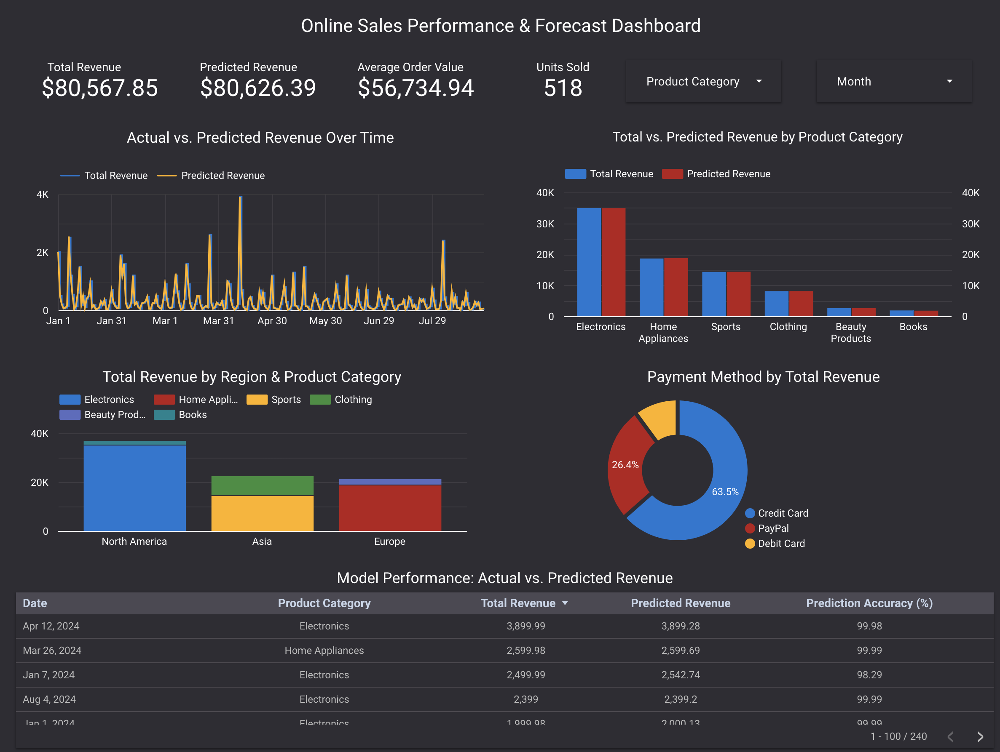

# Online Sales Revenue Prediction & Dashboard Project

This project builds a machine learning model to predict transaction-level online sales revenue and presents interactive business insights in a Looker Studio dashboard. It includes data cleaning, feature engineering, model tuning, performance visualization, and dashboard integration.

---

## Table of Contents

- [Dashboard Preview](#-dashboard-preview)
- [Dataset Overview](#-dataset-overview)
- [Data Preprocessing](#-data-preprocessing)
- [Exploratory Data Analysis](#-exploratory-data-analysis)
- [Predictive Modeling](#-predictive-modeling)
- [Looker Studio Dashboard](#-looker-studio-dashboard)
- [Key Insights](#-key-insights)
- [Technologies Used](#-technologies-used)
- [Project Structure](#-project-structure)
- [Author & License](#-author--license)

---

## Dashboard Preview

> 

---

## Dataset Overview

- **Source**: Simulated e-commerce sales transactions  
- **Rows**: 240 transactions  
- **Fields**:
  - Transaction ID, Date, Product Name, Product Category
  - Units Sold, Unit Price, Total Revenue
  - Region, Payment Method

---

## Data Preprocessing

- Verified no missing or duplicate values  
- Converted `Date` to datetime  
- Created derived time fields: `Month`, `DayOfWeek`  
- Verified revenue calculations (`Units Sold × Unit Price = Total Revenue`)  
- Removed high-cardinality and redundant columns (e.g., Product Name for modeling)

---

## Exploratory Data Analysis

Visualized sales performance by category, region, and time:

- **Electronics** led in revenue; **Asia** led in units sold  
- Revenue spiked in **January, March, and April**  
- **Credit Cards** were the most common payment method  
- Revenue per unit was highest in **North America**

---

## Predictive Modeling

### Final Model: Tuned Gradient Boosting Regressor (via GridSearchCV)

- **MAE**: $18.76  
- **RMSE**: $31.55  
- **R² Score**: 0.995

### Best Parameters:

  'learning_rate': 0.1,
  'max_depth': 4,
  'n_estimators': 200

### Feature Importance (Top Drivers):

- Unit Price (dominant)
- Units Sold
- Month of Transaction

---

## Looker Studio Dashboard

> [View Dashboard](https://lookerstudio.google.com/reporting/6fa0d845-fd6d-42a4-a6b9-00cac27e3da1)

### KPIs
- Total Revenue  
- Predicted Revenue  
- Revenue Accuracy  
- Units Sold

### Charts
- Time Series: Actual vs. Predicted Revenue  
- Bar Chart: Revenue by Product Category  
- Stacked Bar: Revenue by Region and Category  
- Table: Actual vs. Predicted Revenue + Error  
- Scatter Plot: Prediction Fit & Outliers

### Interactive Filters
- Region (Dropdown)  
- Product Category (List)  
- Month Name (Dropdown via calculated field)  
- Payment Method (Dropdown)  
- Date Range (Date Picker)

---

## Key Insights

- **Unit Price** is the top predictor of revenue  
- **High-value sales** are concentrated in North America  
- Predictions align closely with actuals (R² = 0.995)  
- Category- and region-based filtering helps isolate key revenue drivers

---

## Technologies Used

- Python (pandas, scikit-learn, matplotlib, seaborn)
- Jupyter Notebook
- Google Looker Studio
- XGBoost, Gradient Boosting
- Git & GitHub

---

## Project Structure

online_sales_project/ 
├── data/ 
│ └── Online Sales Data.csv 
├── notebooks/ 
│ └── sales_prediction_analysis.ipynb 
├── outputs/ 
│ └── looker_ready_sales_data.csv 
├── dashboard/ 
│ └── looker_studio_link.txt 
└── README.md 

---

## Author & License

**Author**: Matt Baglietto  
matt.baglietto11@gmail.com
[LinkedIn](https://www.linkedin.com/in/matthewbaglietto)
